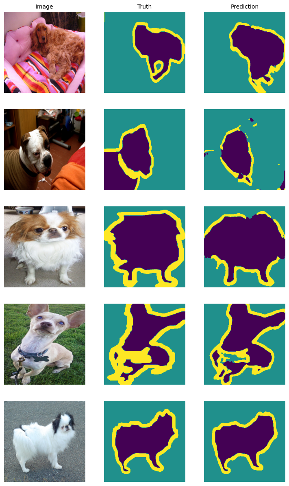

# Image Segmentation

This repository contains a deep learning project focused on performing image segmentation on the Oxford-IIIT Pet Dataset. Utilizing a U-Net architecture, the model is trained to accurately segment pet images, identifying the precise boundaries of the animals within the images. This project serves as a practical example of implementing U-Net for semantic segmentation tasks in computer vision.


## Installation

1. Clone the repository:

```
git clone https://github.com/hoverslam/image-segmentation
```

2. Navigate to the directory:

```
cd image-segmentation
```

3. Set up a virtual environment:

```bash
# Create a virtual environment
python -3.11 -m venv .venv

# Activate the virtual environment
.venv\Scripts\activate
```

4. (Optional) Install PyTorch with CUDA support:

```
pip install torch==2.3.1 torchvision==0.18.1 --index-url https://download.pytorch.org/whl/cu118
```

5. Install the dependencies:

```
pip install -r requirements.txt
```


## U-Net

The U-Net architecture is a convolutional neural network designed for image segmentation. It consists of an encoder that captures context and a decoder that enables precise localization, making it highly effective for segmenting images. Skip connections are a key feature of U-Net that link the encoder and decoder pathways directly. They preserve high-resolution features and detailed spatial information by combining low-level details with high-level context.

> [U-Net: Convolutional Networks for Biomedical Image Segmentation](https://arxiv.org/abs/1505.04597) by Olaf Ronneberger, Philipp Fischer, and Thomas Brox (2015).


## Dataset

The [Oxford-IIIT Pet Dataset](https://www.robots.ox.ac.uk/~vgg/data/pets/) is a collection of images featuring 37 different pet breeds. Each image comes with a corresponding segmentation mask that divides the image into three distinct classes: pet, background, and border. The dataset provides a total of 7349 images, split into 3680 training samples and 3669 test samples. Notably, the training data is further divided into training and validation sets using a 75:25 ratio.


## Results

| | Train | Val | Test |
|---|---|---|---|
| IoU | 0.7718 | 0.7013 | 0.6976 |
| Accuracy | 0.9507 | 0.9224 | 0.9181 |

</br>
<div align="center">

</div>


## License

The code in this project is licensed under the [MIT License](LICENSE.txt).
